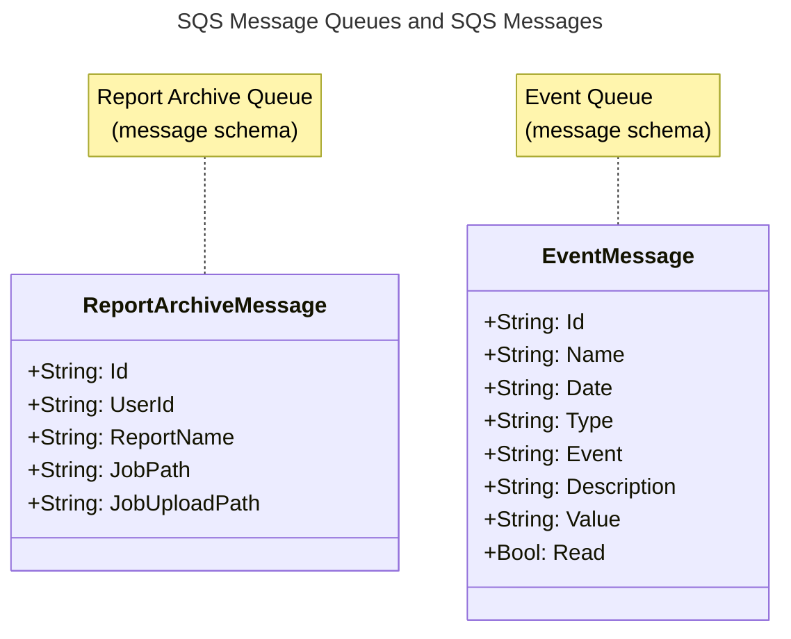
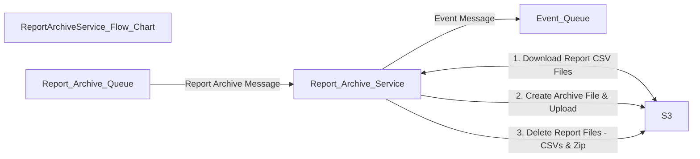

```mermaid
---
title: SQS Message Queues and SQS Messages
---

classDiagram
    class ReportArchiveMessage {
        +String: Id
        +String: UserId
        +String: ReportName
        +String: JobPath
        +String: JobUploadPath
    }
    
    note for ReportArchiveMessage "Report Archive Queue
    
    (message schema)"

    class EventMessage {
        +String: Id
        +String: Name
        +String: Date
        +String: Type
        +String: Event
        +String: Description
        +String: Value
        +Bool: Read 
    }
    
    note for EventMessage "Event Queue
    
    (message schema)"
```

```mermaid
flowchart LR

ReportArchiveService_Flow_Chart

Report_Archive_Queue -->|Report Archive Message| Report_Archive_Service
Report_Archive_Service <--->|1. Download Report CSV Files| S3
Report_Archive_Service -->|2. Create Archive File & Upload| S3
Report_Archive_Service -->|3. Delete Report Files - CSVs & Zip| S3
Report_Archive_Service -->|Event Message| Event_Queue
```
